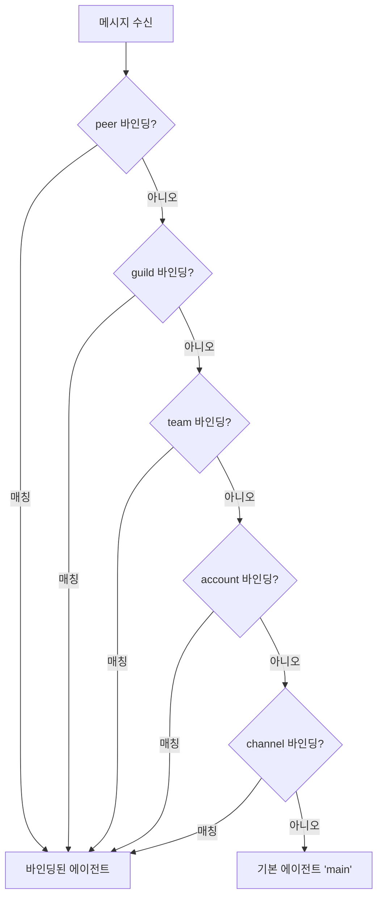

# 채널 라우팅

OpenClaw가 인바운드 메시지를 올바른 에이전트와 세션으로 라우팅하는 방법입니다.

## 핵심 용어

| 용어           | 설명                                                    |
| -------------- | ------------------------------------------------------- |
| **Channel**    | 메시징 플랫폼 (telegram, whatsapp, discord 등)          |
| **AccountId**  | 채널 내 봇/계정 식별자                                  |
| **AgentId**    | OpenClaw 에이전트 식별자 (main, coding 등)              |
| **SessionKey** | 세션을 고유하게 식별하는 키                              |

## 세션 키 형식

### DM (다이렉트 메시지)

```
agent:<agentId>:<channel>:dm:<senderId>
```

예: `agent:main:telegram:dm:123456789`

### 그룹

```
agent:<agentId>:<channel>:group:<groupId>
```

예: `agent:main:whatsapp:group:12345@g.us`

### 스레드 지원 채널 (Discord, Slack)

```
agent:<agentId>:<channel>:thread:<threadId>
```

## 라우팅 규칙

메시지가 도착하면 다음 순서로 에이전트를 결정합니다:



### 우선순위

1. **peer** — 특정 발신자/그룹 매칭 (가장 높음)
2. **guild** — Discord 서버 매칭
3. **team** — Slack 워크스페이스 매칭
4. **account** — 채널 계정 매칭
5. **channel** — 채널 전체 매칭
6. **기본** — `main` 에이전트 (가장 낮음)

## 바인딩 설정

### 에이전트 정의

```json5
{
  agents: {
    list: [
      {
        id: "main",
        model: "anthropic/claude-opus-4-6",
      },
      {
        id: "coding",
        model: "anthropic/claude-opus-4-6",
        workspace: "~/projects",
      },
      {
        id: "quick",
        model: "anthropic/claude-sonnet-4-20250514",
      },
    ],
  },
}
```

### 바인딩 규칙

```json5
{
  bindings: [
    // 특정 Telegram 사용자를 coding 에이전트로
    {
      peer: { kind: "dm", channel: "telegram", sender: "123456789" },
      agent: "coding",
    },
    // Discord 특정 서버를 quick 에이전트로
    {
      peer: { kind: "guild", channel: "discord", group: "987654321" },
      agent: "quick",
    },
    // WhatsApp 그룹을 coding 에이전트로
    {
      peer: { kind: "group", channel: "whatsapp", group: "12345@g.us" },
      agent: "coding",
    },
  ],
}
```

## 브로드캐스트 그룹

하나의 메시지를 여러 에이전트에게 동시에 전달합니다 (실험적):

```json5
{
  agents: {
    list: [
      {
        id: "reviewer",
        model: "anthropic/claude-opus-4-6",
        broadcast: {
          peers: ["translator"],
          strategy: "parallel",
        },
      },
      {
        id: "translator",
        model: "anthropic/claude-sonnet-4-20250514",
      },
    ],
  },
}
```

### 처리 전략

| 전략         | 설명                     |
| ------------ | ------------------------ |
| `parallel`   | 모든 에이전트 동시 실행  |
| `sequential` | 순서대로 실행            |

### 사용 예

- **코드 리뷰 팀**: 보안 에이전트 + 성능 에이전트 + 스타일 에이전트
- **다국어 지원**: 영어 에이전트 + 한국어 에이전트
- **QA 워크플로우**: 테스트 에이전트 + 문서 에이전트

## 세션 격리

각 에이전트는 독립적인 세션을 가집니다:

```
agent:main:telegram:dm:123     (main 에이전트의 세션)
agent:coding:telegram:dm:123   (coding 에이전트의 세션)
```

같은 발신자라도 라우팅된 에이전트에 따라 별도의 세션에서 대화합니다.

## 세션 저장소

```
~/.openclaw/state/<agentId>/sessions/
├── <sessionKey-hash>/
│   ├── session.jsonl     # 대화 히스토리
│   └── metadata.json     # 세션 메타데이터
```

## 다음 단계

- [그룹 메시지](/ko-KR/channels/group-messages) - 그룹 채팅 처리
- [멀티 에이전트](/ko-KR/concepts/multi-agent) - 멀티 에이전트 설정
- [채널 개요](/ko-KR/channels) - 지원 채널 전체
