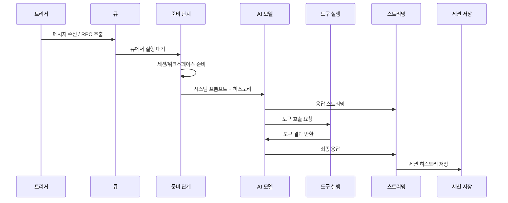

# 에이전트 실행 루프

에이전트 루프는 메시지 수신부터 AI 모델 추론, 도구 실행, 응답 스트리밍, 세션 저장까지의 전체 실행 흐름입니다.

## 전체 흐름



## 진입점

에이전트 루프는 두 가지 경로로 시작됩니다:

### Gateway RPC

Gateway의 WebSocket 프로토콜을 통해 `agent` 또는 `agent.wait` 메서드로 호출됩니다.

```
→ agent { sessionKey, message, attachments?, overrides? }
← agent.started → agent.delta → agent.tool → agent.end
```

- `agent`: Fire-and-forget (응답 이벤트로 수신)
- `agent.wait`: 전체 결과가 완료될 때까지 대기

### CLI

```bash
openclaw agent --message "안녕하세요"
```

CLI는 내부적으로 Gateway RPC를 호출하거나, Gateway 없이 직접 에이전트를 실행합니다.

## 실행 단계 상세

### 1단계: 큐 진입

모든 인바운드 메시지는 세션별 FIFO 큐에 진입합니다. 큐는 동일 세션에서 에이전트 실행이 겹치지 않도록 직렬화합니다.

- 기본 동시성: `main` 레인 4, `subagent` 레인 8
- 큐 모드: `collect`(기본값), `steer`, `followup`, `interrupt` 등
- 자세한 내용은 [메시지 큐](/ko-KR/concepts/queue) 참조

### 2단계: 세션/워크스페이스 준비

에이전트 실행 전 다음을 준비합니다:

1. **세션 로드**: 세션 키로 히스토리 로드 (JSONL)
2. **워크스페이스 해석**: 에이전트별 워크스페이스 디렉토리 결정
3. **스킬 로드**: 활성화된 스킬의 `SKILL.md` 파일 수집
4. **부트스트랩 파일 로드**: `AGENTS.md`, `SOUL.md`, `TOOLS.md` 등

```
~/.openclaw/workspace/
├── AGENTS.md         # 에이전트 지침 (항상 주입)
├── SOUL.md           # 성격 정의
├── TOOLS.md          # 도구 사용 지침
├── IDENTITY.md       # 에이전트 정체성
├── USER.md           # 사용자 정보
├── HEARTBEAT.md      # 하트비트 지침
├── BOOTSTRAP.md      # 첫 실행 지침
└── skills/           # 커스텀 스킬
```

### 3단계: 시스템 프롬프트 조립

시스템 프롬프트는 다음 순서로 조립됩니다:

1. **베이스 프롬프트**: Pi 에이전트 코어의 기본 지침
2. **부트스트랩 파일**: `AGENTS.md`, `SOUL.md`, `TOOLS.md` 등의 내용
3. **스킬 목록**: 활성화된 스킬 이름/설명 (전체 지침은 에이전트가 필요 시 읽음)
4. **런타임 메타데이터**: 현재 시간, 타임존, 워크스페이스 경로
5. **실행별 오버라이드**: RPC 호출 시 전달된 `overrides`

### 4단계: 모델 추론

조립된 프롬프트와 세션 히스토리를 AI 모델에 전송합니다.

- **스트리밍**: 응답 토큰이 생성되는 대로 `assistant` 이벤트로 방출
- **도구 호출**: 모델이 도구 사용을 결정하면 `tool` 이벤트 방출
- **사고 과정**: `thinking` 레벨에 따라 추론 블록 포함

### 5단계: 도구 실행

모델이 도구 호출을 요청하면:

1. 도구 이름과 인자 파싱
2. **`before_tool_call` 훅** 실행 (플러그인이 가로채거나 수정 가능)
3. 도구 실행 (bash, read, write, browser 등)
4. **`after_tool_call` 훅** 실행
5. 결과를 모델에 반환하여 추가 추론
6. **`tool_result_persist` 훅** 실행 (세션 저장 시)

도구 실행 후 모델은 추가 도구 호출 또는 최종 응답을 결정합니다. 이 루프는 모델이 최종 텍스트 응답을 생성할 때까지 반복됩니다.

### 6단계: 응답 조립

최종 페이로드는 다음으로 구성됩니다:

- **어시스턴트 텍스트**: 모델의 텍스트 응답
- **도구 요약**: 도구 실행 결과 요약 (설정에 따라)
- **오류 텍스트**: 실행 중 발생한 오류

### 7단계: 세션 저장

실행 완료 후:

1. 전체 대화 턴 (사용자 메시지 + 어시스턴트 응답)을 세션 JSONL에 추가
2. 세션 메타데이터 업데이트 (마지막 활동 시각 등)
3. 컴팩션 트리거 여부 확인

## 훅 포인트

에이전트 루프에는 확장 프로그램이 개입할 수 있는 여러 훅 포인트가 있습니다:

| 훅 이름                 | 시점                   | 용도                           |
| ----------------------- | ---------------------- | ------------------------------ |
| `agent:bootstrap`       | 워크스페이스 준비 시   | 파일 주입, 환경 설정           |
| `before_agent_start`    | 에이전트 실행 직전     | 시스템 프롬프트 수정           |
| `before_tool_call`      | 도구 실행 직전         | 도구 호출 가로채기/수정        |
| `after_tool_call`       | 도구 실행 직후         | 결과 로깅, 후처리              |
| `tool_result_persist`   | 도구 결과 저장 시      | 저장 전 변환                   |
| `before_compaction`     | 컨텍스트 압축 직전     | 압축 전 작업                   |
| `after_compaction`      | 컨텍스트 압축 직후     | 압축 후 작업                   |
| `agent_end`             | 에이전트 실행 완료 후  | 응답 로깅, 알림                |

### 훅 사용 예시

```typescript
// 플러그인에서 훅 등록
api.on("before_agent_start", async (ctx) => {
  // 시스템 프롬프트에 추가 지침 주입
  ctx.systemPrompt += "\n\n항상 한국어로 응답하세요.";
});

api.on("after_tool_call", async (ctx) => {
  // 도구 실행 결과 로깅
  console.log(`도구 ${ctx.toolName} 실행 완료:`, ctx.result);
});
```

## 자동 컴팩션

세션 히스토리가 모델의 컨텍스트 윈도우에 가까워지면 자동 컴팩션이 트리거됩니다:

1. 오래된 대화 내용을 요약
2. 요약을 세션 JSONL에 저장
3. 최근 메시지만 유지
4. 실패 시 자동 재시도

수동 컴팩션:

```
/compact [요약 지침]
```

## 오류 처리

| 오류 유형             | 동작                               |
| --------------------- | ---------------------------------- |
| 모델 API 오류         | 인증 프로필 회전 → 모델 폴백       |
| 컨텍스트 오버플로우   | 자동 컴팩션 후 재시도              |
| 도구 실행 실패        | 에러 메시지를 모델에 반환          |
| 타임아웃              | 실행 중단, 부분 응답 전송          |

## 개발자 참고사항

확장 프로그램이나 플러그인을 개발할 때:

- **훅은 빠르게 실행**되어야 합니다. 긴 작업은 비동기로 처리하세요.
- **`before_tool_call`** 훅에서 `false`를 반환하면 도구 실행을 차단할 수 있습니다.
- **`before_agent_start`** 훅에서 시스템 프롬프트를 수정할 수 있지만, 원본 프롬프트를 덮어쓰지 마세요.
- 에이전트 루프의 소스 코드는 `src/agents/pi-embedded-runner/run/` 에서 확인할 수 있습니다.

## 다음 단계

- [메시지 큐](/ko-KR/concepts/queue) - 큐 모드와 동시성 관리
- [컨텍스트 관리](/ko-KR/concepts/context) - 컨텍스트 윈도우 검사와 관리
- [모델 장애 조치](/ko-KR/concepts/model-failover) - 인증 프로필 회전과 모델 폴백
- [훅 자동화](/ko-KR/automation/hooks) - 이벤트 기반 자동화 구현
