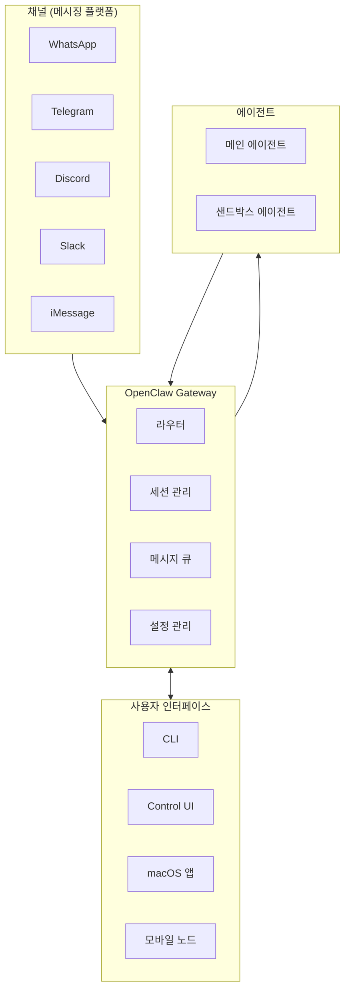
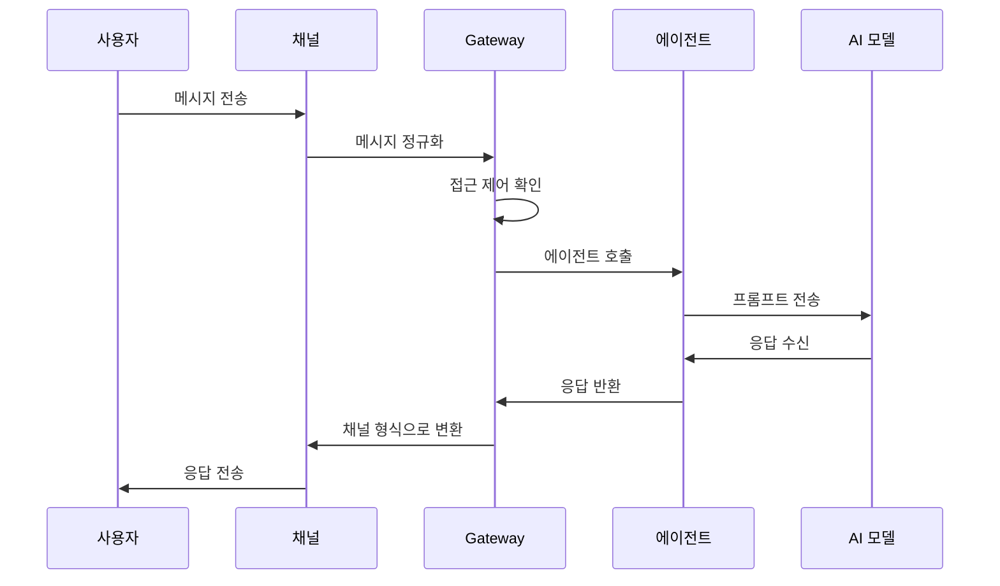
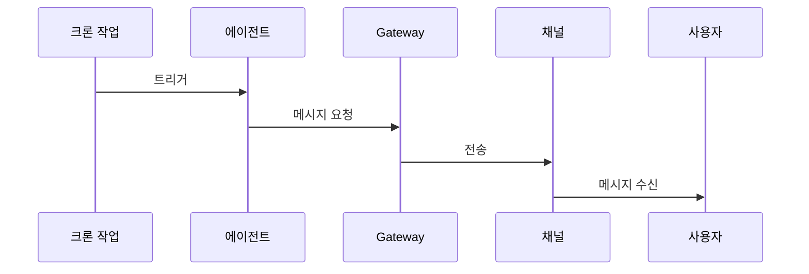

# 아키텍처

이 문서는 OpenClaw의 전체 아키텍처와 핵심 개념을 설명합니다.

## 시스템 개요



## 핵심 컴포넌트

### 1. Gateway

Gateway는 OpenClaw의 핵심입니다. 모든 메시지 라우팅, 세션 관리, 채널 연결을 담당합니다.

**주요 역할:**

- 채널별 인바운드/아웃바운드 메시지 처리
- 세션 상태 관리
- 에이전트 호출 조정
- 인증 및 접근 제어

### 2. 채널

각 메시징 플랫폼을 위한 어댑터입니다.

| 채널     | 라이브러리 | 연결 방식              |
| -------- | ---------- | ---------------------- |
| WhatsApp | Baileys    | WebSocket (Web)        |
| Telegram | grammY     | Long-polling / Webhook |
| Discord  | discord.js | WebSocket              |
| Slack    | Bolt       | Socket Mode            |

### 3. 에이전트

AI 모델과 상호작용하는 컴포넌트입니다.

**에이전트 기능:**

- AI 모델 호출
- 도구 실행
- 컨텍스트 관리
- 응답 생성

### 4. 세션

사용자별 대화 상태를 관리합니다.

**세션 키 형식:**

```
agent:<agentId>:<channel>:<type>:<identifier>
```

예시:

- DM: `agent:main:telegram:dm:123456789`
- 그룹: `agent:main:whatsapp:group:12345678901@g.us`

## 메시지 흐름

### 인바운드 흐름 (사용자 → 에이전트)



### 아웃바운드 흐름 (에이전트 → 사용자)

에이전트가 먼저 메시지를 보내는 경우 (예: 크론 작업, 하트비트):



## 멀티 에이전트 라우팅

특정 발신자나 그룹을 다른 에이전트로 라우팅할 수 있습니다.

```json5
{
  agents: {
    list: [
      {
        id: "main",
        model: "anthropic/claude-opus-4-6",
      },
      {
        id: "coding",
        model: "anthropic/claude-opus-4-6",
        workspace: "~/.openclaw/coding",
      },
    ],
  },
  bindings: [
    {
      peer: { kind: "dm", channel: "telegram", sender: "123456789" },
      agent: "coding",
    },
  ],
}
```

## 세션 관리

### 세션 범위

| 범위          | 설명                   |
| ------------- | ---------------------- |
| `per-sender`  | 발신자별 세션 (기본값) |
| `per-channel` | 채널별 단일 세션       |

### 세션 스토어

세션 데이터는 로컬 파일 시스템에 저장됩니다:

```
~/.openclaw/sessions/
├── agent:main:telegram:dm:123456789/
│   ├── history.json
│   └── state.json
└── agent:main:whatsapp:group:abc@g.us/
    ├── history.json
    └── state.json
```

### 세션 명령어

```bash
# 세션 목록
openclaw sessions list

# 세션 히스토리
openclaw sessions history <session-key>

# 세션 초기화
openclaw sessions reset <session-key>
```

## 도구 시스템

에이전트가 사용할 수 있는 도구들입니다.

### 기본 도구

| 도구      | 설명             |
| --------- | ---------------- |
| `bash`    | 쉘 명령어 실행   |
| `read`    | 파일 읽기        |
| `write`   | 파일 쓰기        |
| `edit`    | 파일 편집        |
| `browser` | 웹 브라우저 제어 |

### 채널 도구

| 도구       | 설명               |
| ---------- | ------------------ |
| `message`  | 메시지 전송        |
| `react`    | 리액션 추가        |
| `telegram` | Telegram 특정 액션 |
| `whatsapp` | WhatsApp 특정 액션 |

### 스킬

워크스페이스별로 커스텀 도구를 정의할 수 있습니다:

```
~/.openclaw/workspace/skills/
└── my-skill/
    └── SKILL.md
```

## 샌드박스

비-주 세션(그룹, 채널)은 Docker 샌드박스에서 실행할 수 있습니다.

```json5
{
  agents: {
    defaults: {
      sandbox: {
        mode: "non-main",
        baseImage: "openclaw/sandbox:latest",
      },
    },
  },
}
```

### 샌드박스 도구 제한

| 허용                    | 거부              |
| ----------------------- | ----------------- |
| `bash`, `read`, `write` | `browser`         |
| `edit`, `process`       | `canvas`          |
| `sessions_*`            | `cron`, `gateway` |

## 워크스페이스

에이전트가 작업하는 디렉토리입니다.

```
~/.openclaw/workspace/
├── AGENTS.md         # 에이전트 지침
├── SOUL.md           # 성격 정의
├── TOOLS.md          # 도구 사용 지침
├── HEARTBEAT.md      # 하트비트 지침
└── skills/           # 커스텀 스킬
```

## 다음 단계

- [설정 가이드](/ko-KR/gateway/configuration) - 상세 설정 옵션
- [채널 설정](/ko-KR/channels) - 각 채널별 설정
- [보안](/ko-KR/gateway/security) - 보안 설정
