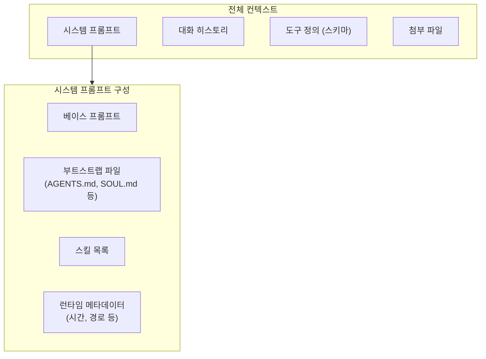

# 컨텍스트 관리

컨텍스트는 AI 모델에 전송되는 모든 정보의 합입니다. 시스템 프롬프트, 대화 히스토리, 도구 호출 결과, 첨부 파일 등이 포함됩니다.

## 컨텍스트 구성 요소



### 시스템 프롬프트에 포함되는 정보

| 항목                | 설명                                        |
| ------------------- | ------------------------------------------- |
| 도구 정의           | 사용 가능한 도구 이름과 JSON 스키마          |
| 스킬 목록           | 이름과 한 줄 설명 (전체 지침은 온디맨드)     |
| 워크스페이스 위치   | 에이전트 작업 디렉토리 경로                  |
| 현재 시간           | 로컬 시간과 타임존                           |
| 런타임 메타데이터   | 플랫폼, 버전, 채널 정보                      |
| 부트스트랩 파일     | AGENTS.md, SOUL.md, TOOLS.md 등의 전체 내용  |

### 주입되는 워크스페이스 파일

| 파일              | 용도                   | 주입 조건     |
| ----------------- | ---------------------- | ------------- |
| `AGENTS.md`       | 에이전트 전역 지침     | 항상          |
| `SOUL.md`         | 성격/페르소나 정의     | 존재 시       |
| `TOOLS.md`        | 도구 사용 지침         | 존재 시       |
| `IDENTITY.md`     | 에이전트 정체성        | 존재 시       |
| `USER.md`         | 사용자 정보            | 존재 시       |
| `HEARTBEAT.md`    | 하트비트 지침          | 하트비트 실행 시 |
| `BOOTSTRAP.md`    | 첫 실행 지침           | 첫 실행 시    |

### 도구의 컨텍스트 영향

도구는 두 가지 방식으로 컨텍스트에 영향을 줍니다:

1. **도구 목록 텍스트**: 시스템 프롬프트에 포함되는 도구 이름과 설명
2. **도구 스키마 (JSON)**: 각 도구의 입력 파라미터 정의

도구가 많을수록 컨텍스트 사용량이 증가합니다.

## 컨텍스트 검사

### 채팅 명령어

```
/status              # 현재 세션 상태 요약
/context list        # 컨텍스트 구성 요소 목록
/context detail      # 상세 컨텍스트 정보
/usage tokens        # 토큰 사용량
/usage full          # 전체 사용량 (비용 포함)
/usage cost          # 비용 정보
```

### CLI 명령어

```bash
openclaw status              # 전체 상태
openclaw status --deep       # 상세 진단
```

## 컨텍스트 최적화

### 수동 컴팩션

컨텍스트가 너무 커지면 `/compact` 명령어로 요약:

```
/compact                     # 기본 요약
/compact 코드 관련 내용만 유지  # 지침 포함 요약
```

컴팩션은 오래된 대화를 요약하고 최근 메시지만 유지합니다. 요약은 세션 히스토리에 저장됩니다.

### 자동 컴팩션

세션이 모델의 컨텍스트 윈도우에 가까워지면 자동으로 컴팩션이 트리거됩니다. 수동 개입 없이 서비스가 계속됩니다.

### 세션 프루닝

세션 프루닝은 오래된 도구 결과를 인메모리에서 트리밍합니다:

- 디스크의 세션 히스토리는 변경하지 않음
- LLM 호출 직전에 적용
- Anthropic API 호출에만 영향

**소프트 트림**: 큰 결과의 시작부와 끝부만 유지

**하드 클리어**: 전체 결과를 플레이스홀더로 교체

### 도구 프로필

불필요한 도구를 비활성화하여 컨텍스트를 줄일 수 있습니다:

```json5
{
  agents: {
    defaults: {
      tools: {
        profile: "minimal",  // minimal, coding, messaging, full
      },
    },
  },
}
```

| 프로필      | 포함 도구                          |
| ----------- | ---------------------------------- |
| `minimal`   | 기본 도구만 (read, write, bash)    |
| `coding`    | 코딩 관련 (+ edit, process)        |
| `messaging` | 메시징 관련 (+ message, react)     |
| `full`      | 모든 도구                          |

### 히스토리 제한

세션당 유지할 최대 메시지 수:

```json5
{
  agents: {
    defaults: {
      historyLimit: 50,
    },
  },
}
```

## 문제 해결

### 컨텍스트 오버플로우

증상: 에이전트가 "컨텍스트가 너무 큽니다" 오류 반환

1. `/compact`로 수동 컴팩션
2. `/reset`으로 세션 초기화
3. 사용하지 않는 도구/스킬 비활성화
4. 히스토리 제한 설정

### 느린 응답

컨텍스트가 클수록 응답이 느려집니다:

1. `/usage tokens`로 토큰 사용량 확인
2. `/compact`로 컨텍스트 줄이기
3. 도구 프로필을 `minimal`로 변경
4. 더 큰 컨텍스트 윈도우 모델 사용

## 다음 단계

- [에이전트 실행 루프](/ko-KR/concepts/agent-loop) - 컨텍스트가 사용되는 전체 흐름
- [세션](/ko-KR/concepts/sessions) - 세션 관리와 히스토리
- [시스템 프롬프트](/ko-KR/concepts/system-prompt) - 프롬프트 커스터마이징
