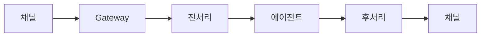

# 메시지

OpenClaw에서 메시지가 처리되는 방식입니다.

## 메시지 흐름



## 메시지 유형

### 텍스트

기본 텍스트 메시지.

### 미디어

| 유형   | 지원                |
| ------ | ------------------- |
| 이미지 | ✅ Vision 모델 분석 |
| 오디오 | ✅ 음성 변환 (STT)  |
| 비디오 | ✅ 프레임 분석      |
| 문서   | ✅ 텍스트 추출      |

### 위치

```json5
{
  type: "location",
  latitude: 37.5665,
  longitude: 126.978,
}
```

## 마크다운 포맷팅

### 지원 형식

| 형식      | 문법           |
| --------- | -------------- |
| 굵게      | `**text**`     |
| 기울임    | `*text*`       |
| 코드      | `` `code` ``   |
| 코드 블록 | ` ```code``` ` |
| 링크      | `[text](url)`  |
| 목록      | `- item`       |

### 채널별 변환

각 채널에 맞게 마크다운이 변환됩니다:

| 채널     | 지원                |
| -------- | ------------------- |
| Telegram | HTML로 변환         |
| Discord  | 네이티브 지원       |
| Slack    | Slack 형식으로 변환 |
| WhatsApp | 제한적 지원         |

## 멘션 패턴

### 그룹에서 호출

```json5
{
  messages: {
    groupChat: {
      mentionPatterns: ["@openclaw", "@claw", "클로"],
    },
  },
}
```

### 정규식 패턴

```json5
{
  messages: {
    groupChat: {
      mentionPatterns: ["/^클로야/"], // 정규식
    },
  },
}
```

## 메시지 제한

### 길이 제한

```json5
{
  messages: {
    maxLength: 4096,
    truncate: true,
  },
}
```

### 분할 전송

긴 응답 자동 분할:

```json5
{
  messages: {
    split: {
      enabled: true,
      maxLength: 4096,
      separator: "\n\n",
    },
  },
}
```

## 미디어 처리

### 이미지

```json5
{
  media: {
    images: {
      maxSize: "10mb",
      analyze: true, // Vision 모델로 분석
    },
  },
}
```

### 오디오

```json5
{
  media: {
    audio: {
      maxDuration: 300, // 초
      transcribe: true, // STT
    },
  },
}
```

### 문서

```json5
{
  media: {
    documents: {
      maxSize: "50mb",
      extract: true, // 텍스트 추출
      types: ["pdf", "docx", "txt"],
    },
  },
}
```

## 전처리

메시지가 에이전트에 도달하기 전:

### 필터

```json5
{
  messages: {
    preprocess: {
      filters: [
        {
          pattern: "스팸",
          action: "drop",
        },
      ],
    },
  },
}
```

### 변환

```json5
{
  messages: {
    preprocess: {
      transforms: [
        {
          pattern: "@everyone",
          replace: "",
        },
      ],
    },
  },
}
```

## 후처리

에이전트 응답 후:

### 필터

```json5
{
  messages: {
    postprocess: {
      filters: [
        {
          pattern: "민감정보",
          action: "redact",
        },
      ],
    },
  },
}
```

## 읽음 확인

### 설정

```json5
{
  channels: {
    whatsapp: {
      readReceipts: true,
    },
    telegram: {
      readReceipts: true,
    },
  },
}
```

## 메시지 저장

### 히스토리

```
~/.openclaw/sessions/<session-key>/history.json
```

### 미디어 저장

```json5
{
  media: {
    storage: {
      path: "~/.openclaw/media",
      retention: "30d",
    },
  },
}
```
