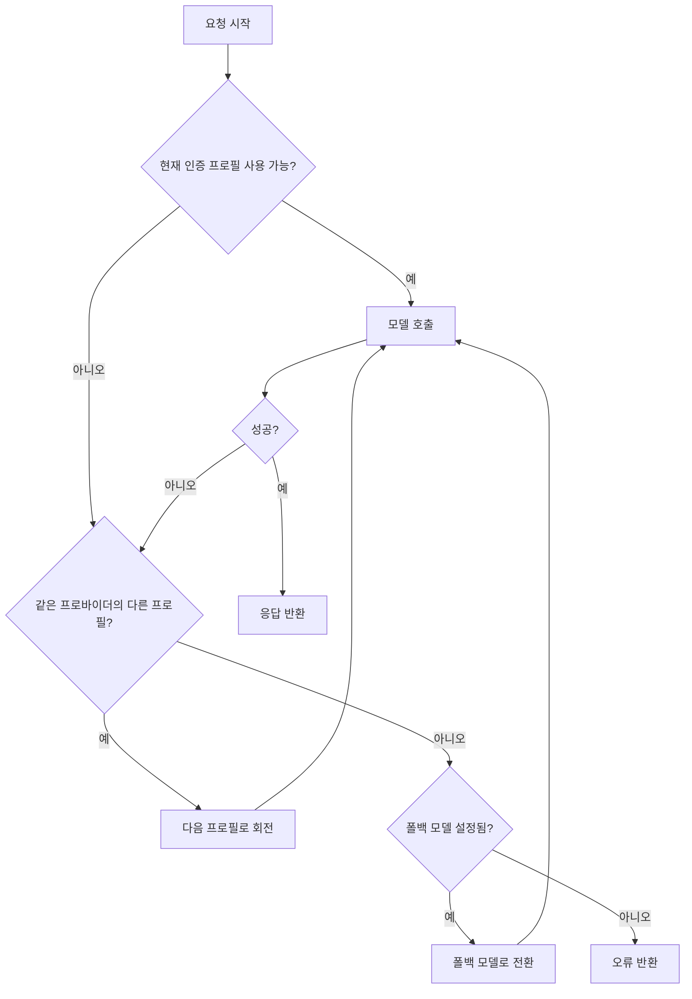

# 모델 장애 조치

OpenClaw는 인증 프로필 회전과 모델 폴백 2단계 전략으로 서비스 중단을 최소화합니다.

## 동작 원리



## 1단계: 인증 프로필 회전

같은 프로바이더 내에서 여러 인증 프로필 사이를 자동으로 회전합니다.

### 인증 프로필이란?

프로바이더별로 여러 API 키나 OAuth 토큰을 등록할 수 있습니다:

```
~/.openclaw/agents/<agentId>/agent/auth-profiles.json
```

예를 들어 Anthropic에 개인 API 키와 Claude Pro 구독 토큰을 모두 등록할 수 있습니다.

### 세션 고정

세션은 선택된 인증 프로필에 **고정(sticky)** 됩니다:

- 세션 시작 시 사용 가능한 프로필 선택
- 이후 같은 세션에서는 동일 프로필 재사용
- 세션 리셋이나 컴팩션 시 프로필 재선택

### 쿨다운 정책

실패한 프로필은 지수 백오프로 쿨다운됩니다:

| 실패 유형         | 쿨다운 시간                    |
| ----------------- | ------------------------------ |
| 일반 API 오류     | 1분 → 5분 → 25분 → 1시간      |
| 할당량 초과 (429) | 1분 → 5분 → 25분 → 1시간      |
| 결제 비활성화     | 5시간 → 24시간                 |

쿨다운 중인 프로필은 건너뛰고 다음 프로필을 시도합니다.

## 2단계: 모델 폴백

같은 프로바이더의 모든 프로필이 실패하면, 설정된 폴백 모델 목록으로 이동합니다.

### 폴백 설정

```json5
{
  agents: {
    defaults: {
      model: {
        default: "anthropic/claude-opus-4-6",
        fallbacks: [
          "anthropic/claude-sonnet-4-20250514",
          "openai/gpt-4.1",
          "google/gemini-2.5-pro",
        ],
      },
    },
  },
}
```

폴백 순서:
1. `anthropic/claude-opus-4-6` (기본) — 실패 시
2. `anthropic/claude-sonnet-4-20250514` (첫 번째 폴백) — 실패 시
3. `openai/gpt-4.1` (두 번째 폴백) — 실패 시
4. `google/gemini-2.5-pro` (세 번째 폴백)

### 에이전트별 폴백

```json5
{
  agents: {
    list: [
      {
        id: "critical-agent",
        model: {
          default: "anthropic/claude-opus-4-6",
          fallbacks: ["openai/gpt-4.1"],
        },
      },
    ],
  },
}
```

## 인증 프로필 관리

```bash
# API 키 기반
export ANTHROPIC_API_KEY=sk-ant-...

# OAuth 기반
openclaw models auth setup-token         # Anthropic 구독
openclaw models auth github-copilot      # GitHub Copilot
openclaw models auth openai-codex        # OpenAI Codex

# 프로필 순서 변경
openclaw models auth order

# 세션별 오버라이드
/model anthropic/claude-opus-4-6@profile-2
```

## 모니터링

```bash
openclaw status --deep      # 프로필별 상태 확인
openclaw models auth list   # 프로필 목록
```

채팅에서:

```
/status                     # 현재 상태 요약
/usage tokens               # 토큰 사용량
```

## 문제 해결

| 증상                     | 해결                                          |
| ------------------------ | --------------------------------------------- |
| 모든 프로필 실패         | `openclaw status --deep`로 확인 후 재등록     |
| 예상치 못한 모델 사용    | `/status`로 폴백 여부 확인, `/reset`으로 해제 |
| 잦은 프로필 회전         | API 할당량/결제 상태 확인                     |

## 다음 단계

- [모델 프로바이더](/ko-KR/concepts/model-providers) - 지원 프로바이더 전체 목록
- [OAuth 인증](/ko-KR/concepts/oauth) - OAuth 토큰 관리 상세
- [에이전트 설정](/ko-KR/concepts/agent) - 에이전트별 모델 설정
