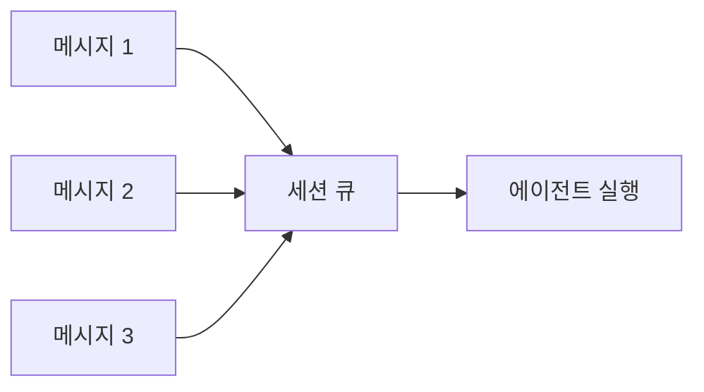

# 메시지 큐

OpenClaw는 레인 기반 FIFO 큐로 인바운드 메시지를 관리합니다. 동일 세션에서 에이전트 실행이 겹치지 않도록 직렬화하면서, 다양한 큐 모드로 메시지 처리 방식을 제어할 수 있습니다.

## 핵심 개념

### 레인 (Lane)

레인은 독립적인 동시 실행 단위입니다.

| 레인       | 기본 동시성 |
| ---------- | ----------- |
| 미설정     | 1           |
| `main`     | 4           |
| `subagent` | 8           |

### FIFO 큐

각 세션은 자체 FIFO 큐를 가집니다. 에이전트가 이미 실행 중이면 새 메시지는 큐에 대기합니다.



## 큐 모드

### collect (기본값)

대기 중인 메시지들을 하나의 팔로업 턴으로 합칩니다.

```
사용자: "파일 목록 보여줘"    → [에이전트 실행 시작]
사용자: "그리고 로그도"       → [큐에 대기]
사용자: "최근 것만"           → [큐에 대기]
                               → [에이전트 실행 완료]
                               → "그리고 로그도\n최근 것만" 으로 합쳐서 실행
```

### steer

이전 실행 결과를 무시하고 새 메시지로 방향을 전환합니다.

```
사용자: "파이썬으로 서버 만들어"  → [에이전트 실행 시작]
사용자: "아니 Go로 해줘"         → [이전 실행 중단, 새 실행 시작]
```

### followup

대기 중인 메시지를 각각 별도의 턴으로 순차 실행합니다.

### interrupt

현재 실행을 중단하고 새 메시지로 즉시 전환합니다.

### steer-backlog

`steer`와 유사하지만 이전 대기 메시지를 백로그로 유지합니다.

## 큐 설정

```json5
{
  agents: {
    defaults: {
      queue: {
        mode: "collect",         // 기본 큐 모드
        debounceMs: 1500,        // 디바운스 대기 시간 (ms)
        cap: 10,                 // 최대 대기 메시지 수
        drop: "old",             // 초과 시 정책: old, new, summarize
      },
    },
  },
}
```

| 옵션          | 설명                      | 기본값    |
| ------------- | ------------------------- | --------- |
| `mode`        | 큐 모드                   | `collect` |
| `debounceMs`  | 연속 메시지 대기 시간     | 1500      |
| `cap`         | 최대 대기 메시지 수       | 10        |
| `drop`        | 캡 초과 시 정책           | `old`     |

### 세션별 오버라이드

채팅에서 현재 세션의 큐 모드를 변경:

```
/queue steer
/queue collect
/queue followup
```

## 디바운싱

`debounceMs`는 연속 메시지를 묶는 대기 시간입니다:

```json5
{
  messages: {
    inbound: {
      debounceMs: 2000,  // 2초 디바운스
    },
  },
}
```

## 실전 시나리오

| 용도              | 권장 모드    |
| ----------------- | ------------ |
| 코딩 에이전트     | `collect`    |
| 빠른 Q&A         | `followup`   |
| 대화형 에이전트   | `steer`      |

## 다음 단계

- [에이전트 실행 루프](/ko-KR/concepts/agent-loop) - 큐에서 실행까지의 전체 흐름
- [스트리밍](/ko-KR/concepts/streaming) - 응답 스트리밍 설정
- [세션](/ko-KR/concepts/sessions) - 세션 관리
