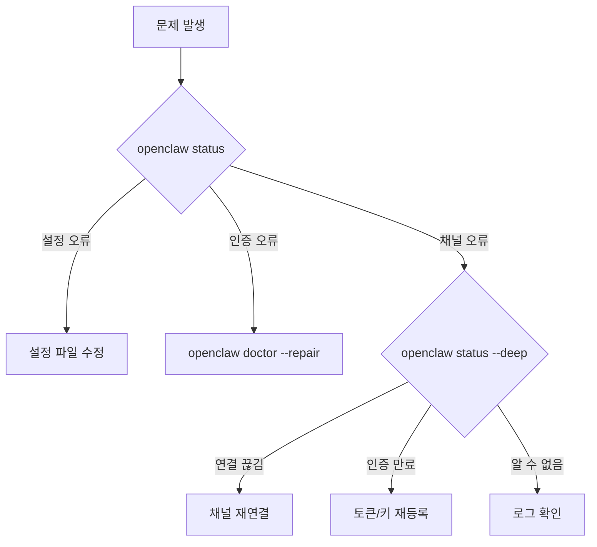

# 헬스 체크

Gateway와 채널의 상태를 진단하고 문제를 발견하는 방법입니다.

## 빠른 진단

### CLI 명령어

```bash
# 로컬 요약
openclaw status

# 전체 진단
openclaw status --all

# Gateway 프로브 (실행 중인 Gateway에 연결)
openclaw status --deep

# JSON 형식의 전체 헬스 스냅샷
openclaw health --json
```

### 채팅 명령어

어떤 채널에서든 `/status`를 보내면 상태 요약을 받을 수 있습니다.

```
/status
```

## 상태 수준

### `openclaw status`

로컬 파일 시스템만 검사합니다:

- 설정 파일 유효성
- 인증 프로필 존재 여부
- 워크스페이스 디렉토리 상태

### `openclaw status --all`

위 항목 + 추가 검사:

- 각 채널별 인증 상태
- 세션 디렉토리 상태
- 플러그인 로딩 상태

### `openclaw status --deep`

실행 중인 Gateway에 연결하여 실시간 진단:

- 채널 연결 상태 (WebSocket, 폴링 등)
- 인증 프로필 유효성 (OAuth 만료 여부)
- 세션 활성 상태
- 메모리 사용량

### `openclaw health --json`

프로그래밍 방식으로 사용할 수 있는 JSON 형식 출력:

```json
{
  "gateway": { "status": "running", "uptime": 86400 },
  "channels": {
    "whatsapp": { "status": "connected", "accountId": "..." },
    "telegram": { "status": "connected", "botName": "..." }
  },
  "agents": {
    "main": { "model": "anthropic/claude-opus-4-6", "sessions": 12 }
  }
}
```

## Doctor 명령어

종합적인 상태 점검과 자동 수리 도구:

```bash
# 대화형 점검
openclaw doctor

# 기본값 자동 수락
openclaw doctor --yes

# 자동 수리 적용
openclaw doctor --repair

# 적극적 수리
openclaw doctor --repair --force
```

### Doctor가 검사하는 항목

| 항목                     | 설명                                 |
| ------------------------ | ------------------------------------ |
| 설정 유효성              | 설정 파일 파싱 및 스키마 검증        |
| 레거시 마이그레이션      | 이전 버전 설정 키 자동 변환          |
| 상태 무결성              | 세션 디렉토리, 권한, 파일 일관성     |
| 모델 인증                | OAuth 만료, 비활성 프로필 감지       |
| 샌드박스 이미지          | Docker 이미지 유효성                 |
| 서비스 설정              | systemd/launchd 설정 감사            |
| 보안 경고                | 오픈 DM 정책 등 위험 설정 감지       |
| 스킬 상태                | 스킬 로딩 상태 요약                  |
| Gateway 인증 토큰        | 토큰 생성/검증                       |

## 로그 확인

```bash
# 최근 로그
openclaw logs

# 필터링
openclaw logs --filter gateway
openclaw logs --filter whatsapp

# 로그 파일 위치
# macOS/Linux: /tmp/openclaw/openclaw-*.log
# Windows: %TEMP%\openclaw\openclaw-*.log
```

## 채널별 진단

### WhatsApp

```bash
openclaw channels status whatsapp
```

- 연결 상태 (QR 코드 필요 여부)
- 세션 유효성
- 마지막 메시지 시각

### Telegram

```bash
openclaw channels status telegram
```

- 봇 토큰 유효성
- 폴링/웹훅 상태
- 봇 정보

### Discord

```bash
openclaw channels status discord
```

- 봇 토큰 유효성
- 서버 목록
- 인텐트 설정

## 문제 해결 흐름



## 다음 단계

- [로깅](/ko-KR/gateway/logging) - 로그 설정과 분석
- [문제 해결](/ko-KR/help/troubleshooting) - 일반적인 문제와 수정
- [보안](/ko-KR/gateway/security) - 보안 설정
