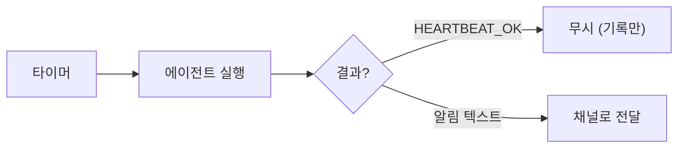

# 하트비트

하트비트는 에이전트를 주기적으로 실행하여 모니터링, 유지보수, 알림 등을 자동화하는 기능입니다.

## 동작 방식

1. 설정된 주기마다 에이전트 실행
2. `HEARTBEAT.md` 파일의 지침을 프롬프트로 사용
3. 에이전트가 점검 후 `HEARTBEAT_OK` (이상 없음) 또는 알림 텍스트 반환
4. 알림이 있으면 지정된 채널로 전달



## 기본 설정

```json5
{
  agents: {
    defaults: {
      heartbeat: {
        every: "30m",            // 실행 주기 (기본: 30분)
      },
    },
  },
}
```

Anthropic OAuth/setup-token 사용 시 기본값은 1시간입니다.

## 상세 설정

```json5
{
  agents: {
    defaults: {
      heartbeat: {
        every: "1h",              // 실행 주기
        model: "anthropic/claude-sonnet-4-20250514",  // 하트비트 전용 모델
        activeHours: "09:00-18:00",  // 활성 시간대 (로컬)
        includeReasoning: false,  // 추론 과정 포함 여부
        showOk: false,            // HEARTBEAT_OK도 전달할지
        showAlerts: true,         // 알림 전달
        ackMaxChars: 500,         // 알림 최대 길이
      },
    },
  },
}
```

### 에이전트별 오버라이드

```json5
{
  agents: {
    list: [
      {
        id: "monitor",
        heartbeat: {
          every: "15m",           // 더 짧은 주기
          model: "anthropic/claude-haiku-3-5-20241022",  // 빠르고 저렴한 모델
        },
      },
    ],
  },
}
```

## HEARTBEAT.md 작성

워크스페이스에 `HEARTBEAT.md` 파일을 생성하여 하트비트 지침을 정의합니다:

```markdown
# 하트비트 점검

## 점검 항목

1. 디스크 사용량이 90% 이상인지 확인
2. 최근 로그에 ERROR가 있는지 확인
3. 서비스가 정상 실행 중인지 확인

## 응답 규칙

- 모든 것이 정상이면: `HEARTBEAT_OK`
- 문제 발견 시: 문제 설명과 권장 조치 작성
```

`HEARTBEAT_OK`를 반환하면 아무런 알림이 전송되지 않습니다.

## 전달 대상

### 기본 동작

하트비트 결과는 **메인 세션**으로 전달됩니다 (보통 DM).

### 특정 채널 지정

```json5
{
  agents: {
    defaults: {
      heartbeat: {
        target: "telegram",      // 채널 지정
        to: "123456789",         // 수신자 ID
      },
    },
  },
}
```

### 다중 계정

```json5
{
  agents: {
    defaults: {
      heartbeat: {
        accountId: "whatsapp:821012345678",  // 특정 계정
      },
    },
  },
}
```

## 활성 시간

특정 시간대에만 하트비트를 실행합니다:

```json5
{
  agents: {
    defaults: {
      heartbeat: {
        activeHours: "09:00-22:00",  // 오전 9시 ~ 오후 10시
      },
    },
  },
}
```

활성 시간 외에는 하트비트가 건너뛰어집니다.

## 수동 실행

하트비트를 즉시 트리거할 수 있습니다:

```bash
openclaw system event heartbeat
```

## 비용 고려사항

- 하트비트마다 API 토큰을 소비합니다
- 빈번한 실행은 비용이 증가합니다
- 비용 절감을 위해:
  - 경량 모델 사용 (`claude-haiku` 등)
  - 적절한 주기 설정
  - `activeHours`로 불필요한 시간 제외

## 크론과의 차이

| 항목       | 하트비트                    | 크론                         |
| ---------- | --------------------------- | ---------------------------- |
| 주기       | 단일 간격 (`every`)        | 크론 표현식                  |
| 프롬프트   | `HEARTBEAT.md` 자동 로드   | 사용자 정의 스크립트         |
| 세션       | 메인 세션, keepalive 없음  | 격리된 세션                  |
| 용도       | 상태 모니터링              | 예약 작업 실행               |

자세한 크론 설정은 [크론 작업](/ko-KR/automation/cron) 참조.

## 다음 단계

- [크론 작업](/ko-KR/automation/cron) - 예약 작업 실행
- [자동화 개요](/ko-KR/automation) - 자동화 옵션 전체
- [에이전트 설정](/ko-KR/concepts/agent) - 에이전트 커스터마이징
