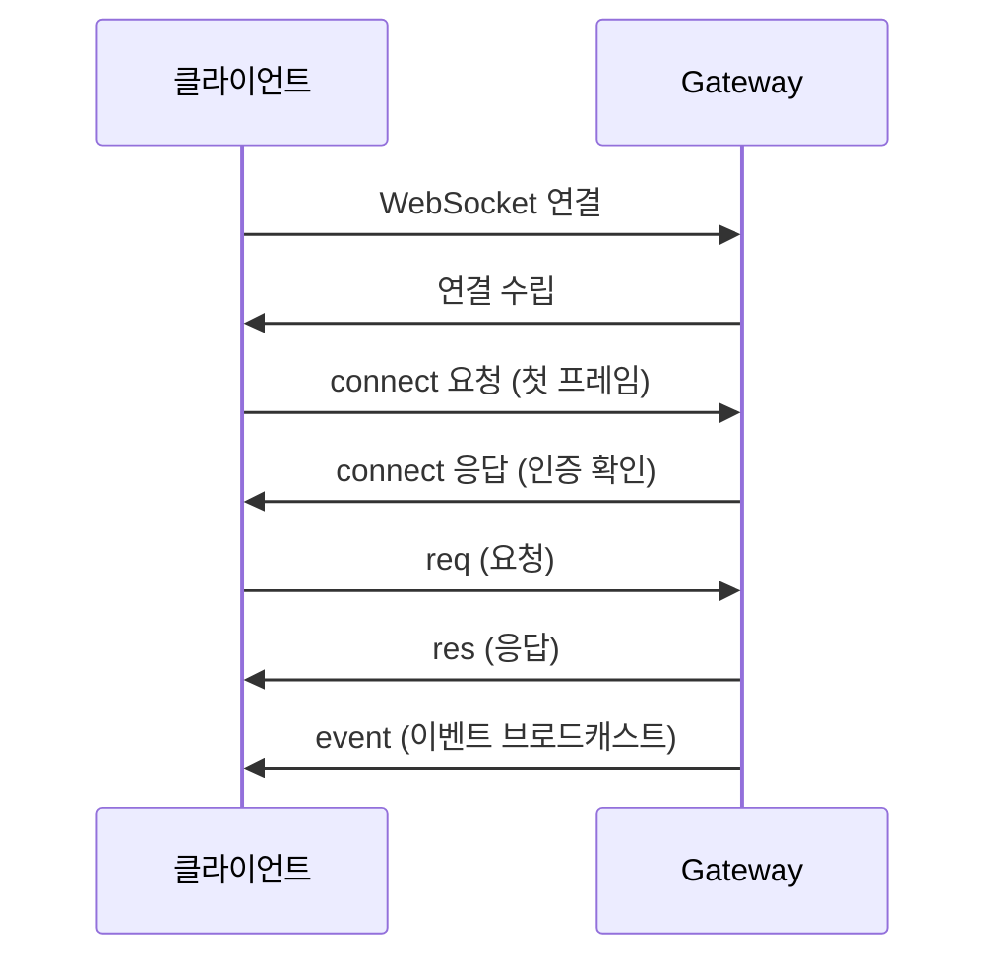

# 게이트웨이 프로토콜

Gateway는 JSON 텍스트 프레임 기반의 WebSocket 프로토콜로 모든 클라이언트와 통신합니다. CLI, Control UI, macOS 앱, 모바일 노드, 자동화 도구 등이 이 프로토콜을 사용합니다.

## 연결 흐름



### 핸드셰이크

첫 번째 프레임은 반드시 `connect` 요청이어야 합니다:

```json
{
  "type": "req",
  "method": "connect",
  "params": {
    "role": "operator",
    "scope": ["operator.read", "operator.write"],
    "token": "gateway-auth-token",
    "version": "2026.2.6"
  }
}
```

Gateway가 토큰을 검증하고 연결을 승인합니다.

## 프레임 타입

### req (요청)

클라이언트 → Gateway 방향의 RPC 호출:

```json
{
  "type": "req",
  "id": "req-001",
  "method": "agent",
  "params": {
    "sessionKey": "agent:main:telegram:dm:123",
    "message": "안녕하세요"
  }
}
```

### res (응답)

Gateway → 클라이언트 방향의 요청 응답:

```json
{
  "type": "res",
  "id": "req-001",
  "result": { "status": "ok" }
}
```

오류 응답:

```json
{
  "type": "res",
  "id": "req-001",
  "error": { "code": "NOT_FOUND", "message": "세션을 찾을 수 없습니다" }
}
```

### event (이벤트)

Gateway → 모든 클라이언트 방향의 브로드캐스트:

```json
{
  "type": "event",
  "event": "agent.delta",
  "data": {
    "sessionKey": "agent:main:telegram:dm:123",
    "text": "응답 텍스트..."
  }
}
```

## 역할 (Role)

| 역할       | 설명                              | 용도                    |
| ---------- | --------------------------------- | ----------------------- |
| `operator` | 사용자 대면 클라이언트            | CLI, Control UI, macOS  |
| `node`     | 기능 호스트 (카메라, 마이크 등)   | iOS, Android 노드       |

### Operator 스코프

| 스코프               | 설명                     |
| -------------------- | ------------------------ |
| `operator.read`      | 상태 조회, 이벤트 수신   |
| `operator.write`     | 메시지 전송, 설정 변경   |
| `operator.admin`     | 관리자 작업              |
| `operator.approvals` | 도구 실행 승인           |
| `operator.pairing`   | 디바이스 페어링          |

## 주요 메서드

### 에이전트

| 메서드          | 설명                           |
| --------------- | ------------------------------ |
| `agent`         | 에이전트 실행 (비동기)         |
| `agent.wait`    | 에이전트 실행 (완료 대기)      |
| `agent.abort`   | 실행 중인 에이전트 중단        |

### 채팅

| 메서드          | 설명                           |
| --------------- | ------------------------------ |
| `chat.send`     | 메시지 전송                    |
| `chat.history`  | 세션 히스토리 조회             |
| `chat.inject`   | 메시지 주입 (히스토리에 추가)  |

### 세션

| 메서드              | 설명                       |
| ------------------- | -------------------------- |
| `sessions.list`     | 세션 목록                  |
| `sessions.reset`    | 세션 초기화                |
| `sessions.compact`  | 컨텍스트 압축              |

### 시스템

| 메서드            | 설명                         |
| ----------------- | ---------------------------- |
| `status`          | Gateway 상태                 |
| `health`          | 상세 헬스 체크               |
| `config.get`      | 설정 조회                    |
| `config.set`      | 설정 변경                    |
| `plugins.list`    | 플러그인 목록                |
| `plugins.reload`  | 플러그인 재로드              |

## 이벤트

| 이벤트                | 설명                       |
| --------------------- | -------------------------- |
| `agent.started`       | 에이전트 실행 시작         |
| `agent.delta`         | 응답 스트리밍 조각         |
| `agent.tool`          | 도구 호출 알림             |
| `agent.end`           | 에이전트 실행 완료         |
| `channel.status`      | 채널 상태 변경             |
| `config.changed`      | 설정 변경 알림             |
| `voicewake.changed`   | 웨이크 워드 변경           |

## 인증

### 토큰 인증

```json
{
  "method": "connect",
  "params": {
    "token": "your-gateway-token"
  }
}
```

토큰은 `~/.openclaw/credentials/gateway-token`에 저장됩니다.

### 비밀번호 인증

```json
{
  "method": "connect",
  "params": {
    "password": "your-password"
  }
}
```

### TLS

원격 접속 시 TLS를 사용할 수 있습니다:

```json5
{
  gateway: {
    tls: {
      cert: "/path/to/cert.pem",
      key: "/path/to/key.pem",
    },
  },
}
```

## 디바이스 페어링

모바일 노드(iOS/Android)는 키페어 기반으로 페어링합니다:

1. 노드가 핑거프린트와 함께 `connect` 요청
2. Gateway가 알 수 없는 디바이스면 페어링 코드 발급
3. 사용자가 `openclaw devices approve` 또는 Control UI에서 승인
4. 이후 연결에서는 핑거프린트로 자동 인증

## 프로토콜 버전

프로토콜 스키마는 `schema.ts`에 TypeBox로 정의되어 있습니다. 버전이 맞지 않으면 연결 시 경고가 표시됩니다.

## 개발자 참고

- 전체 메서드 서피스는 TypeBox 스키마로 정의됨
- `src/gateway/server-methods.ts`에서 메서드 디스패치 로직 확인
- `src/gateway/protocol.ts`에서 프레임 타입 정의
- 커스텀 클라이언트 개발 시 `connect` 핸드셰이크부터 구현

## 다음 단계

- [OpenAI 호환 API](/ko-KR/gateway/openai-http-api) - HTTP API 엔드포인트
- [헬스 체크](/ko-KR/gateway/health) - Gateway 상태 진단
- [설정 가이드](/ko-KR/gateway/configuration) - Gateway 설정
