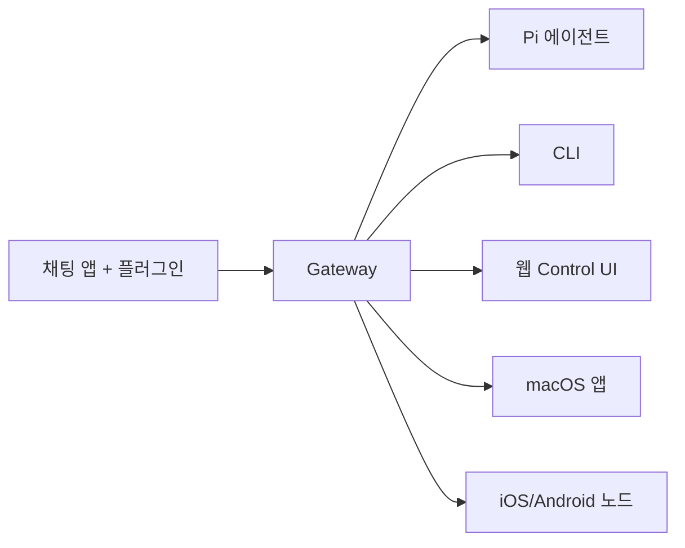

# OpenClaw 🦞

<p align="center">
    
    
</p>

> _"EXFOLIATE! EXFOLIATE!"_ — 우주 바닷가재

<p align="center">
  <strong>WhatsApp, Telegram, Discord, iMessage 등에서 AI 에이전트를 사용할 수 있는 모든 OS용 게이트웨이</strong><br />
  메시지를 보내면 어디서든 에이전트 응답을 받을 수 있습니다.
</p>

## OpenClaw란?

OpenClaw는 여러분이 자주 사용하는 채팅 앱(WhatsApp, Telegram, Discord, iMessage 등)을 Pi 같은 AI 코딩 에이전트와 연결하는 **셀프 호스팅 게이트웨이**입니다. 개인 컴퓨터나 서버에서 하나의 Gateway 프로세스를 실행하면, 메시징 앱과 항상 사용 가능한 AI 어시스턴트 사이의 다리 역할을 합니다.

### 누구를 위한 것인가요?

데이터 제어권을 포기하거나 호스팅 서비스에 의존하지 않으면서 어디서나 메시지를 보낼 수 있는 개인 AI 어시스턴트를 원하는 개발자와 파워 유저를 위한 것입니다.

### 무엇이 다른가요?

- **셀프 호스팅**: 여러분의 하드웨어에서 실행, 여러분의 규칙
- **멀티 채널**: 하나의 Gateway로 WhatsApp, Telegram, Discord 등을 동시에 지원
- **에이전트 네이티브**: 도구 사용, 세션, 메모리, 멀티 에이전트 라우팅을 지원하는 코딩 에이전트용으로 설계
- **오픈 소스**: MIT 라이선스, 커뮤니티 주도

### 무엇이 필요한가요?

Node 22+, API 키(Anthropic 권장), 그리고 5분.

## 작동 방식



Gateway는 세션, 라우팅, 채널 연결의 단일 진실 원천입니다.

## 주요 기능

| 기능                     | 설명                                                              |
| ------------------------ | ----------------------------------------------------------------- |
| **멀티 채널 게이트웨이** | WhatsApp, Telegram, Discord, iMessage를 하나의 Gateway 프로세스로 |
| **플러그인 채널**        | Mattermost 등을 확장 패키지로 추가                                |
| **멀티 에이전트 라우팅** | 에이전트, 워크스페이스, 발신자별 격리된 세션                      |
| **미디어 지원**          | 이미지, 오디오, 문서 송수신                                       |
| **웹 Control UI**        | 채팅, 설정, 세션, 노드를 위한 브라우저 대시보드                   |
| **모바일 노드**          | Canvas 지원이 포함된 iOS/Android 노드 페어링                      |

## 빠른 시작

### 1단계: OpenClaw 설치

**macOS / Linux:**

```bash
curl -fsSL https://openclaw.ai/install.sh | bash
```

**Windows (PowerShell):**

```powershell
iwr -useb https://openclaw.ai/install.ps1 | iex
```

### 2단계: 온보딩 및 서비스 설치

```bash
openclaw onboard --install-daemon
```

### 3단계: WhatsApp 페어링 및 Gateway 시작

```bash
openclaw channels login
openclaw gateway --port 18789
```

## 대시보드

Gateway가 시작되면 브라우저에서 Control UI를 엽니다.

- 로컬 기본값: [http://127.0.0.1:18789/](http://127.0.0.1:18789/)
- 원격 접근: [웹 서피스](/web) 및 [Tailscale](/gateway/tailscale)

## 설정 (선택사항)

설정 파일 위치: `~/.openclaw/openclaw.json`

- **아무것도 하지 않으면** OpenClaw는 발신자별 세션과 함께 RPC 모드에서 번들된 Pi 바이너리를 사용합니다.
- **보안을 강화하려면** `channels.whatsapp.allowFrom`과 (그룹의 경우) 멘션 규칙부터 시작하세요.

예시:

```json5
{
  channels: {
    whatsapp: {
      allowFrom: ["+821012345678"],
      groups: { "*": { requireMention: true } },
    },
  },
  messages: { groupChat: { mentionPatterns: ["@openclaw"] } },
}
```

## 더 알아보기

### 시작하기

- [시작하기](/ko-KR/start/getting-started) - 빠른 설치 및 첫 채팅
- [온보딩 마법사](/ko-KR/start/wizard) - 초기 설정 가이드
- [플랫폼별 설치](/ko-KR/start/platforms) - macOS, Linux, Windows, Docker

### 채널

- [채널 개요](/ko-KR/channels) - 지원 채널 및 공통 설정
- [WhatsApp](/ko-KR/channels/whatsapp) - WhatsApp Web 통합
- [Telegram](/ko-KR/channels/telegram) - Telegram Bot API
- [Discord](/ko-KR/channels/discord) - Discord 봇
- [Slack](/ko-KR/channels/slack) - Slack 앱
- [기타 채널](/ko-KR/channels/others) - iMessage, Google Chat 등
- [채널 라우팅](/ko-KR/channels/channel-routing) - 멀티 에이전트 라우팅 규칙
- [그룹 메시지](/ko-KR/channels/group-messages) - 그룹 채팅 처리와 멘션

### Gateway 설정

- [설정 가이드](/ko-KR/gateway/configuration) - 상세 설정 옵션
- [보안](/ko-KR/gateway/security) - 토큰, 허용 목록, 안전 제어
- [프로토콜](/ko-KR/gateway/protocol) - WebSocket 프로토콜과 RPC 메서드
- [OpenAI 호환 API](/ko-KR/gateway/openai-http-api) - HTTP API 엔드포인트
- [헬스 체크](/ko-KR/gateway/health) - 상태 진단과 Doctor 명령어
- [하트비트](/ko-KR/gateway/heartbeat) - 주기적 에이전트 실행

### 핵심 개념

- [아키텍처](/ko-KR/concepts/architecture) - 시스템 구조 이해
- [에이전트](/ko-KR/concepts/agent) - 모델, 프롬프트, 세션 설정
- [에이전트 실행 루프](/ko-KR/concepts/agent-loop) - 메시지 처리 전체 흐름과 훅 포인트
- [모델 프로바이더](/ko-KR/concepts/model-providers) - AI 모델과 커스텀 프로바이더 설정
- [모델 장애 조치](/ko-KR/concepts/model-failover) - 인증 프로필 회전과 폴백
- [컨텍스트 관리](/ko-KR/concepts/context) - 컨텍스트 윈도우 최적화
- [메시지 큐](/ko-KR/concepts/queue) - 큐 모드와 동시성 관리
- [OAuth 인증](/ko-KR/concepts/oauth) - 구독 기반 OAuth 토큰 관리

### 기능

- [웹 인터페이스](/ko-KR/web) - Control UI, Dashboard, WebChat
- [웹챗](/ko-KR/web/webchat) - 브라우저 기반 채팅
- [터미널 UI](/ko-KR/web/tui) - 터미널에서 Gateway 연결
- [도구](/ko-KR/tools) - 스킬, 플러그인, 명령어
- [스킬 만들기](/ko-KR/tools/creating-skills) - 커스텀 스킬 개발
- [서브에이전트](/ko-KR/tools/subagents) - 백그라운드 에이전트 실행
- [명령어 실행](/ko-KR/tools/exec) - 셸 명령어 실행과 보안
- [브라우저](/ko-KR/tools/browser) - 브라우저 자동화
- [자동화](/ko-KR/automation) - 크론 작업, 웹훅, 하트비트
- [훅](/ko-KR/automation/hooks) - 이벤트 기반 자동화와 커스텀 훅 개발
- [노드 및 미디어](/ko-KR/nodes) - 모바일 노드, 음성, 카메라
- [캔버스](/ko-KR/nodes/canvas) - 화면 공유와 시각적 렌더링

### 참조

- [CLI 레퍼런스](/ko-KR/cli/reference) - 모든 CLI 명령어
- [확장 프로그램 개발](/ko-KR/reference/extension-development) - 플러그인 SDK와 개발 가이드
- [개발 가이드](/ko-KR/reference/contributing) - 프로젝트 기여 방법

### 도움말

- [문제 해결](/ko-KR/help/troubleshooting) - 일반적인 수정 및 진단
- [디버깅](/ko-KR/help/debugging) - 디버깅 도구와 개발 프로필
- [FAQ](/ko-KR/help/faq) - 자주 묻는 질문
