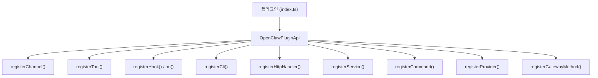

# 확장 프로그램 개발

OpenClaw 확장 프로그램(플러그인)을 처음부터 만드는 방법입니다. 채널 통합, 커스텀 도구, 이벤트 훅, CLI 명령어, 백그라운드 서비스 등을 추가할 수 있습니다.

## 아키텍처 개요



플러그인은 Gateway 프로세스 내에서 실행되는 **신뢰 코드**입니다.

## 빠른 시작

### 1. 디렉토리 구조

```
my-plugin/
├── index.ts                 # 진입점 (필수)
├── package.json             # 패키지 메타데이터
├── openclaw.plugin.json     # 플러그인 매니페스트 (필수)
├── src/                     # 구현 코드
│   ├── channel.ts           # 채널 구현 (채널 플러그인인 경우)
│   └── tools.ts             # 도구 구현 (도구 플러그인인 경우)
└── tsconfig.json
```

### 2. 매니페스트 (openclaw.plugin.json)

```json
{
  "id": "my-plugin",
  "channels": ["my-channel"],
  "configSchema": {
    "type": "object",
    "additionalProperties": false,
    "properties": {
      "apiKey": { "type": "string" },
      "webhookUrl": { "type": "string" }
    }
  }
}
```

| 필드             | 설명                          | 필수 |
| ---------------- | ----------------------------- | ---- |
| `id`             | 플러그인 고유 ID              | 예   |
| `channels`       | 제공하는 채널 ID 목록         | 아니오 |
| `kind`           | 플러그인 슬롯 (예: `memory`) | 아니오 |
| `configSchema`   | 설정 JSON Schema              | 아니오 |

### 3. 진입점 (index.ts)

```typescript
import type { OpenClawPluginApi } from "openclaw/plugin-sdk";
import { emptyPluginConfigSchema } from "openclaw/plugin-sdk";

const plugin = {
  id: "my-plugin",
  name: "My Plugin",
  description: "내 커스텀 플러그인",
  configSchema: emptyPluginConfigSchema(),

  register(api: OpenClawPluginApi) {
    // 여기에 등록 로직
    api.logger.info("My plugin loaded!");
  },
};

export default plugin;
```

### 4. 설치 및 테스트

```json5
// ~/.openclaw/openclaw.json
{
  plugins: {
    enabled: true,
    load: {
      paths: ["~/my-plugin"],
    },
  },
}
```

## Plugin SDK API

### OpenClawPluginApi

`register()` 함수에 전달되는 API 객체입니다:

```typescript
type OpenClawPluginApi = {
  id: string;               // 플러그인 ID
  name: string;             // 플러그인 이름
  config: OpenClawConfig;   // 전체 설정
  pluginConfig?: Record<string, unknown>;  // 플러그인별 설정
  runtime: PluginRuntime;   // 런타임 유틸리티
  logger: PluginLogger;     // 로거

  // 등록 메서드
  registerChannel(registration): void;
  registerTool(factory, opts?): void;
  registerHook(events, handler, opts?): void;
  registerHttpHandler(handler): void;
  registerHttpRoute(params): void;
  registerGatewayMethod(method, handler): void;
  registerCli(registrar, opts?): void;
  registerService(service): void;
  registerProvider(provider): void;
  registerCommand(command): void;

  // 이벤트 단축 메서드
  on(hookName, handler, opts?): void;

  // 유틸리티
  resolvePath(input): string;
};
```

### PluginRuntime

런타임 유틸리티에 접근합니다:

```typescript
api.runtime.config    // 설정 읽기/쓰기
api.runtime.system    // 시스템 이벤트, 명령 실행
api.runtime.media     // 미디어 처리
api.runtime.tts       // TTS
api.runtime.tools     // 도구 생성
api.runtime.channel   // 채널 유틸리티
api.runtime.logging   // 로깅
api.runtime.state     // 상태 디렉토리
```

## 채널 플러그인 개발

채널 플러그인은 새로운 메시징 플랫폼을 통합합니다.

### ChannelPlugin 인터페이스

```typescript
const myChannel: ChannelPlugin = {
  id: "my-channel",
  meta: {
    id: "my-channel",
    label: "My Channel",
    blurb: "My custom channel integration",
  },
  capabilities: {
    text: true,
    images: true,
    audio: false,
    reactions: false,
    threads: false,
    edit: false,
    delete: false,
  },

  // 필수: 설정 어댑터
  config: {
    listAccountIds(config) {
      return ["my-channel:default"];
    },
    resolveAccount(config, accountId) {
      return { token: config.plugins?.entries?.["my-channel"]?.config?.token };
    },
  },

  // 필수: 아웃바운드 어댑터
  outbound: {
    async sendText(ctx, text) {
      // 메시지 전송 구현
      await sendMessage(ctx.account.token, ctx.target, text);
    },
  },

  // 선택: Gateway 어댑터
  gateway: {
    async start(ctx) {
      // 인바운드 메시지 수신 시작
      startPolling(ctx.account, (msg) => {
        ctx.onMessage({
          text: msg.text,
          sender: msg.from,
          channel: "my-channel",
        });
      });
    },
    async stop(ctx) {
      stopPolling();
    },
  },
};
```

### 등록

```typescript
register(api: OpenClawPluginApi) {
  api.registerChannel({ plugin: myChannel });
}
```

### 주요 어댑터

| 어댑터        | 용도                      | 필수 |
| ------------- | ------------------------- | ---- |
| `config`      | 계정 설정 해석            | 예   |
| `outbound`    | 메시지 전송               | 예   |
| `gateway`     | 인바운드 메시지 수신      | 아니오 |
| `setup`       | 채널 설정 마법사          | 아니오 |
| `pairing`     | 발신자 페어링             | 아니오 |
| `security`    | 접근 제어                 | 아니오 |
| `groups`      | 그룹 관리                 | 아니오 |
| `mentions`    | 멘션 감지                 | 아니오 |
| `streaming`   | 스트리밍 응답             | 아니오 |
| `threading`   | 스레드 지원               | 아니오 |
| `actions`     | 메시지 액션 (수정/삭제)   | 아니오 |

## 도구 플러그인 개발

에이전트가 사용할 수 있는 커스텀 도구를 추가합니다.

### 기본 도구

```typescript
register(api: OpenClawPluginApi) {
  api.registerTool(
    (ctx) => ({
      name: "my_tool",
      description: "커스텀 도구",
      parameters: {
        type: "object",
        properties: {
          query: { type: "string", description: "검색 쿼리" },
        },
        required: ["query"],
      },
      async execute(args) {
        const result = await doSomething(args.query);
        return { content: result };
      },
    }),
    { names: ["my_tool"] },
  );
}
```

### 컨텍스트 활용

도구 팩토리는 `OpenClawPluginToolContext`를 받습니다:

```typescript
api.registerTool(
  (ctx) => {
    const config = ctx.config;         // 전체 설정
    const sessionKey = ctx.sessionKey;  // 현재 세션
    // 설정에 따라 도구 반환 또는 null
    if (!config.plugins?.entries?.["my-plugin"]?.config?.apiKey) {
      return null;  // 도구 비활성화
    }
    return myTool;
  },
  { names: ["my_tool"] },
);
```

## 훅 등록

```typescript
register(api: OpenClawPluginApi) {
  // 이벤트별 등록
  api.on("before_agent_start", async (ctx) => {
    ctx.systemPrompt += "\n\n추가 지침";
  });

  api.on("message_received", async (ctx) => {
    api.logger.info(`메시지 수신: ${ctx.message}`);
  });

  api.on("before_tool_call", async (ctx) => {
    if (ctx.toolName === "bash" && ctx.args.command.includes("rm -rf")) {
      return false;  // 도구 실행 차단
    }
  });
}
```

## 자동 응답 명령어 (Auto-Reply Commands)

에이전트를 거치지 않고 직접 처리하는 명령어:

```typescript
register(api: OpenClawPluginApi) {
  api.registerCommand({
    name: "ping",
    description: "핑 테스트",
    acceptsArgs: false,
    handler: async (ctx) => {
      return { text: "pong!" };
    },
  });
}
```

사용자가 `/ping`을 보내면 에이전트 없이 바로 "pong!" 응답.

## CLI 명령어 추가

```typescript
register(api: OpenClawPluginApi) {
  api.registerCli(
    ({ program }) => {
      program
        .command("my-command")
        .description("내 커스텀 명령어")
        .action(async () => {
          console.log("커스텀 명령어 실행!");
        });
    },
    { commands: ["my-command"] },
  );
}
```

```bash
openclaw my-command
```

## HTTP 핸들러

```typescript
register(api: OpenClawPluginApi) {
  api.registerHttpRoute({
    method: "POST",
    path: "/my-plugin/webhook",
    handler: async (req, res) => {
      const body = await req.json();
      // 웹훅 처리
      res.json({ ok: true });
    },
  });
}
```

## Gateway RPC 메서드

```typescript
register(api: OpenClawPluginApi) {
  api.registerGatewayMethod("my-plugin.status", async (params) => {
    return { status: "ok", version: "1.0.0" };
  });
}
```

## 백그라운드 서비스

```typescript
register(api: OpenClawPluginApi) {
  api.registerService({
    name: "my-background-service",
    async start() {
      // 서비스 시작
      startBackgroundWork();
    },
    async stop() {
      // 정리
      stopBackgroundWork();
    },
  });
}
```

## 프로바이더 플러그인

새로운 AI 모델 프로바이더 인증을 추가합니다:

```typescript
register(api: OpenClawPluginApi) {
  api.registerProvider({
    id: "my-provider",
    label: "My Provider",
    auth: [
      {
        type: "api-key",
        envVar: "MY_PROVIDER_API_KEY",
      },
    ],
    models: {
      list: [
        { id: "my-model-v1", label: "My Model V1" },
      ],
    },
  });
}
```

## 설정 스키마와 Control UI

`configSchema`를 정의하면 Control UI에서 설정 폼이 자동 생성됩니다:

```json
{
  "configSchema": {
    "type": "object",
    "properties": {
      "apiKey": {
        "type": "string",
        "description": "API 키",
        "uiHint": "password"
      },
      "enabled": {
        "type": "boolean",
        "description": "활성화 여부",
        "default": true
      },
      "mode": {
        "type": "string",
        "enum": ["fast", "balanced", "quality"],
        "description": "동작 모드"
      }
    }
  }
}
```

## npm 배포

```json
// package.json
{
  "name": "openclaw-plugin-my-plugin",
  "version": "1.0.0",
  "main": "index.ts",
  "keywords": ["openclaw-plugin"],
  "files": ["index.ts", "src/", "openclaw.plugin.json"]
}
```

```bash
npm publish
```

사용자 설치:

```bash
npm install -g openclaw-plugin-my-plugin
```

## 실전 예시: 기존 플러그인 참조

소스 코드에서 참고할 수 있는 실제 플러그인:

| 플러그인      | 경로                              | 유형         |
| ------------- | --------------------------------- | ------------ |
| Telegram      | `extensions/telegram/`            | 채널         |
| Discord       | `extensions/discord/`             | 채널         |
| Memory Core   | `extensions/memory-core/`         | 도구         |
| Voice Call    | `extensions/voice-call/`          | 서비스       |

## 베스트 프랙티스

1. **안전**: 사용자 데이터를 신중하게 처리하고, 위험한 작업에 확인 요청
2. **테스트**: 유닛 테스트와 통합 테스트 작성
3. **에러 핸들링**: 모든 비동기 코드에 try/catch
4. **로깅**: `api.logger`를 사용하고, 민감 정보는 로깅하지 않기
5. **설정 검증**: `configSchema`로 입력 유효성 보장
6. **문서화**: README와 CHANGELOG 유지

## 다음 단계

- [플러그인 관리](/ko-KR/tools/plugins) - 플러그인 설치와 설정
- [훅 자동화](/ko-KR/automation/hooks) - 이벤트 기반 자동화
- [에이전트 실행 루프](/ko-KR/concepts/agent-loop) - 훅 포인트 상세
- [개발 가이드](/ko-KR/reference/contributing) - 프로젝트 기여 방법
