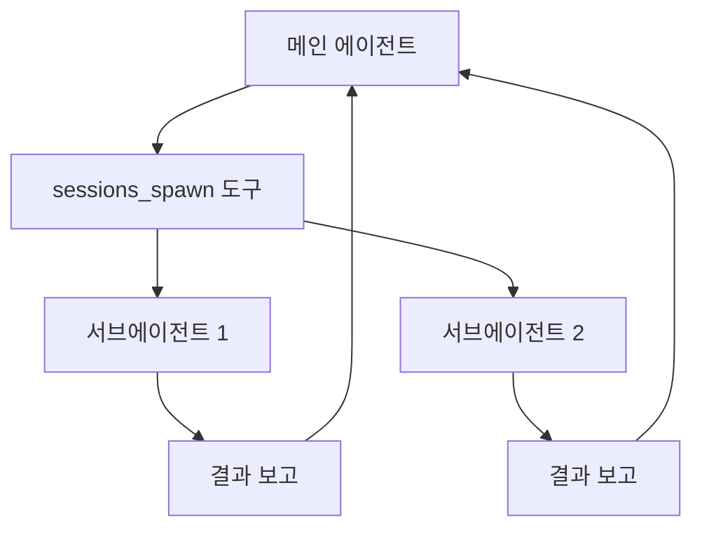

# 서브에이전트

서브에이전트는 현재 실행 중인 에이전트에서 생성되는 백그라운드 에이전트 실행입니다. 병렬 작업, 장시간 작업, 독립적인 조사 등에 사용됩니다.

## 동작 방식



1. 메인 에이전트가 `sessions_spawn` 도구로 서브에이전트 생성
2. 서브에이전트가 독립적으로 실행 (논블로킹)
3. 완료 시 메인 세션에 결과 보고 (announce)

## 서브에이전트 생성

에이전트가 `sessions_spawn` 도구를 호출하여 생성합니다:

```json
{
  "tool": "sessions_spawn",
  "args": {
    "message": "프로젝트의 테스트 커버리지를 분석해줘",
    "model": "anthropic/claude-sonnet-4-20250514",
    "thinking": "medium"
  }
}
```

### 파라미터

| 파라미터   | 설명                          | 기본값              |
| ---------- | ----------------------------- | ------------------- |
| `message`  | 서브에이전트에게 전달할 작업  | (필수)              |
| `model`    | 사용할 모델                   | 메인 에이전트 모델  |
| `thinking` | 사고 레벨                     | 메인 에이전트 설정  |

## 결과 보고 (Announce)

서브에이전트가 작업을 완료하면 메인 세션에 결과를 보고합니다:

- **상태**: 성공/실패
- **결과**: 작업 결과 요약
- **노트**: 추가 참고사항

보고는 **비스트 에포트** 방식입니다. 메인 세션이 이미 종료되었을 수 있습니다.

## 관리

### 채팅에서 관리

```
/subagents              # 현재 서브에이전트 목록 및 상태
```

### 도구 정책

서브에이전트는 기본적으로 모든 도구를 사용할 수 있지만, 세션 도구(`sessions_*`)는 제외됩니다. 서브에이전트가 추가 서브에이전트를 생성하는 것을 방지합니다.

## 동시성

서브에이전트는 전용 `subagent` 레인에서 실행됩니다:

| 레인       | 기본 동시성 |
| ---------- | ----------- |
| `main`     | 4           |
| `subagent` | 8           |

최대 8개의 서브에이전트가 동시에 실행될 수 있습니다.

## 인증

서브에이전트의 인증은 에이전트 ID로 결정됩니다:

1. 서브에이전트의 에이전트 ID로 인증 프로필 검색
2. 없으면 메인 에이전트의 인증 프로필 폴백

## 실전 사용 예시

### 병렬 코드 분석

메인 에이전트에게: "이 프로젝트의 코드 품질을 분석해줘"

에이전트가 서브에이전트를 생성하여:
- 서브에이전트 1: 타입 안전성 검사
- 서브에이전트 2: 테스트 커버리지 분석
- 서브에이전트 3: 의존성 감사

### 장시간 작업

메인 에이전트에게: "백그라운드에서 전체 테스트 실행해줘"

에이전트가 서브에이전트를 생성하여 테스트를 실행하고, 완료 시 결과를 보고합니다.

## 제한사항

- 서브에이전트는 추가 서브에이전트를 생성할 수 없음
- 결과 보고는 비스트 에포트 (보장되지 않음)
- Gateway 리소스를 공유함 (메모리, CPU)
- 논블로킹 — 메인 에이전트는 서브에이전트 완료를 기다리지 않음

## 다음 단계

- [에이전트 실행 루프](/ko-KR/concepts/agent-loop) - 에이전트 실행 흐름
- [메시지 큐](/ko-KR/concepts/queue) - 큐 동시성 관리
- [도구 개요](/ko-KR/tools) - 사용 가능한 도구 전체
